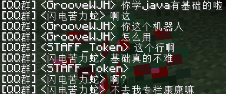
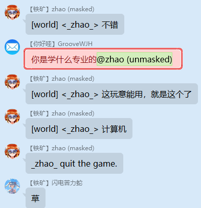

# GS新周目插件进度


## 插件列表

这里列的是将要选用的插件。

| 插件名称                                                     | 功能                             | 适配情况   |
| ------------------------------------------------------------ | -------------------------------- | ---------- |
| BackupFox                                                    | 自动备份、自动停服               | 有待开发   |
| [Plugman](https://dev.bukkit.org/projects/plugman)           | 插件管理                         | 兼容       |
| [Vault](https://www.spigotmc.org/resources/vault.34315/)     | 权限、经济、聊天API              | 兼容       |
| [PlaceholderAPI](https://www.spigotmc.org/resources/placeholderapi.6245/) | 插件共享变量                     | 兼容       |
| [ChatEx](https://www.spigotmc.org/resources/chatex.71041/)   | 聊天管理，屏蔽敏感词、广告，前缀 | 兼容       |
| [LuckPerms](https://luckperms.net/)                          | 权限管理，前缀                   | 兼容       |
| [MinecraftQQSync](https://github.com/mcwmstudio/MC2QQ)       | 服务器和QQ群聊天同步             | 兼容       |
| [CoreProtect](https://www.spigotmc.org/resources/coreprotect.8631/) | 玩家操作记录                     | 兼容       |
| [Multiverse-Core](https://dev.bukkit.org/projects/multiverse-core) | 多世界                           | 重生点有误 |
| [WorldEdit](https://enginehub.org/worldedit/)                | 地图编辑                         | 兼容       |
| [WoldEditSUI](https://www.spigotmc.org/resources/worldeditsui-visualize-your-selection.60726/) | WorldEdit选区可视化              | 兼容       |
| [WorldGuard](https://enginehub.org/worldguard/)              | 世界保护                         | 兼容       |
| [WorldGuard Extra Flags](https://www.spigotmc.org/resources/worldguard-extra-flags.4823/) | WorldGuard扩展                   | 兼容       |
| [GemsEconomy](https://www.spigotmc.org/resources/gemseconomy.19655/) | 经济插件                         | 兼容       |
| [QuickShop](https://www.spigotmc.org/resources/quickshop-reremake-1-16-ready-say-hello-with-rgb.62575/) | 商店插件                         | 兼容       |
| [ProtocolLib](https://www.spigotmc.org/resources/protocollib.1997/) | 修改Minecraft协议的支持库        | 兼容       |
| [LockettePro](https://www.spigotmc.org/resources/lockettepro-for-1-14-1-15.74354/) | 牌子锁                           | 兼容       |
| [CraftBook](https://enginehub.org/craftbook/)                | 游戏扩展                         | 兼容       |
| [ChatFeelings](https://www.spigotmc.org/resources/chatfeelings.12987/) | 聊天表达感情                     | 兼容       |
| [LobbyAPI](https://dev.bukkit.org/projects/lobbyapi)         | 跨世界传送                       | 兼容       |
| [Inventory Rollback](https://www.spigotmc.org/resources/inventory-rollback.48074/) | 背包备份、恢复                   | 兼容       |
| [BentoBox](https://bentobox-world.readthedocs.io/en/latest/) | 空岛插件                         | 兼容       |
| [LobbyAPI](https://dev.bukkit.org/projects/lobbyapi)         | 传送插件                         | 兼容       |
| [Geyser](https://geysermc.org/)                              | 允许基岩版加入Java版服务器       | 兼容       |

## 插件调研

### AutoSaveWorld

#### 功能

* 自动保存
* 自动备份
* 存档上传
* 插件管理
* 自动清理

#### 问题

* 三年没有更新
* 备份有BUG

#### 解决方法

改用BackupFox和Plugman。

### BackupFox

#### 功能

* 自动保存
* 自动备份
* 存档上传

#### 问题

1. 自动保存功能应该删掉
2. 需要添加控制存档数量的功能
3. 自动备份改为指定的时间点
4. 存档上传功能应该删掉

#### 解决方法

继续开发

### Plugman

插件管理

### ChatEx

* 聊天格式
* 玩家加入、退出服务器的信息
* 头衔
* 敏感词过滤
* 广告屏蔽

### CoreProtect

更新了支持1.16.1的版本。

记录服务器中一切行为。

支持SQLite。

不开源，正在考虑改用LogBlock或Prism。

### LaggRemover

这个东西原来GS在用。这个插件的功能主要针对小游戏服，对于生存服来说非常不合适。并且性能上的问题往往并不是掉落物的问题。所以删去。

### Multiverse-Core

用来代替原来的Multiworld。

影响出生点，默认设置是在死亡的世界重生，这肯定不行；如果将地狱和末地的重生世界设置为主世界，那么新版本的重生锚就没法用了。

前缀与ChatEx冲突，可以关闭。

总结：建造时可以用于编辑多个地图，游玩的时候务必关闭。

### GemsEconomy

经济插件。

需要修改配置文件，以支持Vault：

```yaml
vault: true
```

需要使用`/gcurr`命令创建货币。

### QuickShop

主要比较了三种商店：

* [UltimateShops](https://www.spigotmc.org/resources/ultimateshops-player-admin-item-shops-1-8-1-15-x-lite.61048/)：需要半砖，命令使用麻烦就，GUI操作复杂繁琐，好看不中用的东西；
* [ChestShop](https://dev.bukkit.org/projects/chestshop)：经典插件，但是需要按照写告示牌，容易忘记格式；
* [QuickShop](https://www.spigotmc.org/resources/quickshop-reremake-1-16-ready-say-hello-with-rgb.62575/)：最终选择了它。

QuickShop使用方法：

* 创建商店：使用待售物品左键单击商店，之后在聊天框中输入命令，就可以创建商店了。
* 修改设置：右键单击箱子，之后打开聊天栏，可以通过点击来修改箱子的设置。
* 同时买入和卖出：大箱子，一半买，一半卖。

另外：设置中文的方法是在`config.yml`中修改语言：

```yaml
language: zh-CN
```

### CraftBook

此插件功能强大，所谓椅子插件仅为其冰山一角。

需要ProtocolLib。

椅子的设置方法：

在`config.yml`中，将`disabled-mechanics`下的`Chairs`移到`enabled-mechanics`下面。随后打开`mechanism.yml`，修改其中`Chairs`部分的设置。

此插件单击就能坐下，与Rifle Chairs相比容易误操作。

### LobbyAPI

跨世界传送。空岛插件只有回到空岛的命令，没有离开空岛回到主世界的命令。但是按照设计，玩家要离开空岛、返回主世界的主岛，在贸易中心交易后返回空岛。LobbyAPI正好就是一个非常简单方便的跨世界传送插件。

下述命令把主世界添加到传送菜单：

```
/LobbyApi addWorld world 4 ~ ~ ~
```

### Inventory Rollback

恢复背包。CoreProtect不能回滚玩家的背包，所以只能用它了。

### Geyser

有插件版和独立版。

现在服务器好像不能收发UDP包，所以在另一台机器上跑独立版Geyser。

### BentoBox

这个是空岛的一个平台，需要加装其它插件。可以从官网上下载打包好的一组插件。

下载：[https://download.bentobox.world/](https://download.bentobox.world/)

文档：[https://bentobox-world.readthedocs.io/en/latest/](https://bentobox-world.readthedocs.io/en/latest/)

我们选择经典的BSkyBlock。


## 功能需求

### 头衔

#### 要求

信息前面加上前缀：`[prefix]id: content`，Tablist里面也要有，另外prefix需要颜色。

#### 实现

头衔的实现：底层依赖Vault提供API，头衔由LuckPerms设置，由ChatEx显示。

#### 效果

比如我的头衔是红色的`FOX`。首先是聊天：


其次是Tablist中的效果：


#### 设置方法

通过LuckPerms的子命令`meta`修改。

两个参考资料：[LuckPerms Wiki](https://luckperms.net/wiki/Meta-Commands) 和 [颜色代码](https://minecraft.gamepedia.com/Formatting_codes)

```
lp user _zhao_ meta addprefix 90 [&cFOX&f]
```

这样就添加了红色的`FOX`头衔，优先级为90。需要取消头衔的时候：

```
lp user _zhao_ meta removeprefix 90
```

### 聊天同步

主群和QQ群同步消息。

需要[酷Q](https://cqp.cc/)，[CQ HTTP](https://github.com/richardchien/coolq-http-api)，按照[MinecraftQQSync](https://github.com/mcwmstudio/MC2QQ)项目的README.md配置即可。效果：

游戏内：



群里：



最后是TIS维护的一个项目：[点我](https://github.com/TISUnion/ChatBridge)。个人认为，这个插件需要`!!qq`和`!!mc`前缀，而一般玩游戏的时候很少有人会这么干，实用性不高。

同步开关需要进一步细化。

### 不同世界分别设置死亡不掉落

#### 详细要求

| 世界  | 死亡不掉落 |
| --- | ----- |
| 主世界 | 开启    |
| 地狱  | 关闭    |
| 末地  | 关闭    |

#### 实现方法

WorldGuard的Region Flag可以设置全局区域。参考文档：[点我](https://worldguard.enginehub.org/en/latest/regions/global-region/)

WorldGuard Extra Flags扩充了可以设置的内容，其中就包括死亡掉落（分为经验和物品）。

我们要设置主世界死亡不掉落，地狱和末地死亡掉落。

```
gamerule keepInventory false
rg flag __global__ -w world keep-inventory true
rg flag __global__ -w world keep-exp true
```

**注意：对OP无效！！！**

### 剩下没弄的

彩蛋：烧石头有几率获得矿石原矿

定时备份：早八点晚八点，本地

自动更新Paper

提前5分钟、1分钟、30秒提醒关服

AFK挂机，挂机有奖励

@功能

公告

小黑屋

玩家自助更换头衔

羊驼刷物品

随身末影箱

TrMenu